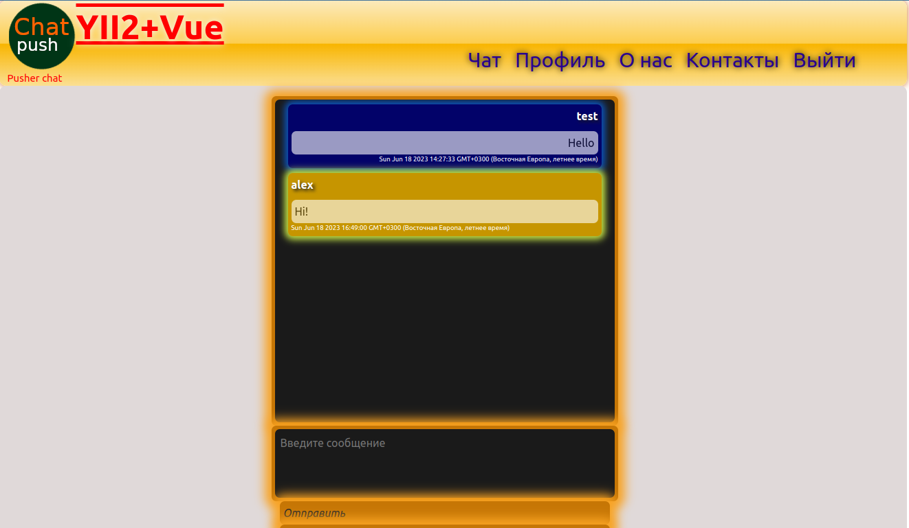
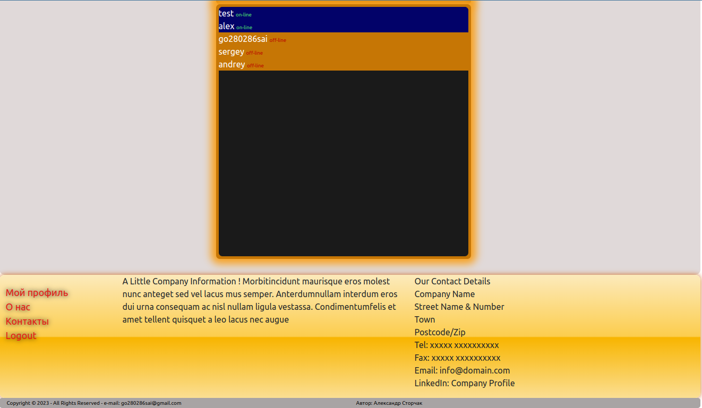
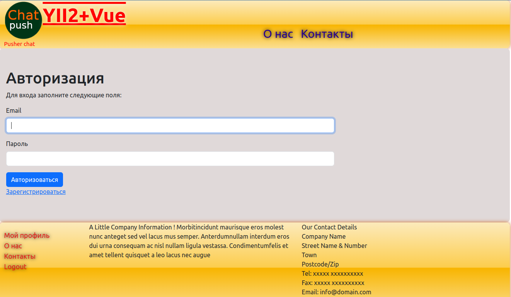
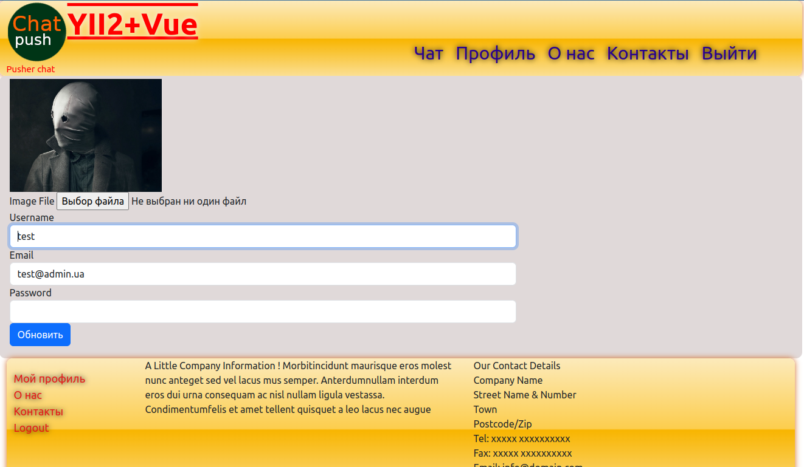
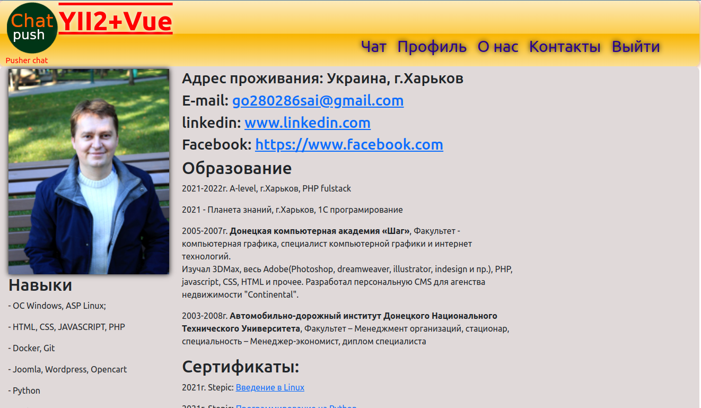
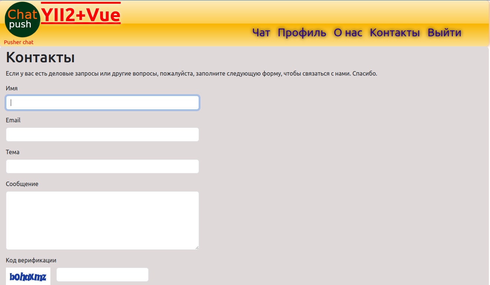

# Конфигурации:
### - NGINX
### - APACHE
### - MYSQL
### - REDIS

Реализация с помощью сервиса https://pusher.com/

Блок вывода на экран:

    

    

    

    
{{ message.name }}

    
{{ message.message }}

    
{{ message.date }}

    

    

    

    

    
{{ message.name }}

    
{{ message.message }}

    
{{ message.date }}

    

    

    

Прослушиваем событие, и добавляем его  "messages: []" для вывода в цикле на экран.

    Pusher.logToConsole = true;
    const pusher = new Pusher("<?= \Yii::$app->params['push_app_key'] ?>", {
        cluster: "<?= \Yii::$app->params['push_app_cluster'] ?>"
    });
    const channel = pusher.subscribe('my-channel');
    channel.bind('my-event', function (data) {
        app.messages.push(JSON.parse(data));
        setTimeout(() => {
            const div = document.getElementById('body-text');
            div.scrollTop = div.scrollHeight;
        }, 1000);
    });

В <textarea class="textarea-send" name="message" id="message" placeholder="Введите сообщение"
v-model="text"></textarea> при помощи v-model="text" считываем текст и отправляем асинхронно
'/chat/pusher'

    public function actionPusher(): string
    {
    if (Yii::$app->request->isPost) {
    $object = (Yii::$app->request->post()['body']);
    $text = Json::encode($object);
    Pusher::send($text);
    return 'ok';
    } else {
    return 'error';
    }
    }

    const app = Vue.createApp({
        data() {
            return {
                status: 0,
                text: '',
                my_id: "<?= $user->id ?? '' ?>",
                messages: [],
            }
        },
        methods: {
            sendMessage() {
                let username = "<?= $user->username ?? '' ?>";
                let message = this.text;
                let id = this.my_id;
                let date = new Date();
                let csfr = "<?= Yii::$app->request->getCsrfToken() ?>";
                $.ajax(
                    {
                        url: "<?= Yii::$app->request->baseUrl . '/chat/pusher' ?>",
                        type: 'POST',
                        data: {
                            body: {
                                id: id,
                                name: username,
                                message: message,
                                date: date
                            }, _csfr: csfr
                        },
                        success: function () {
                            console.log('200');
                        },
                        error: function (err) {
                            console.log(err.message);
                        }
                    }
                );
                this.text = '';
            }
        }
    }).mount('#app');

Pusher::send($text) реализован по шаблону Singleton:

    class Pusher
    {
    private const app_id = "";
    private const key = "";
    private const secret = "";
    private const options = ['cluster' => 'eu', 'useTLS' => true];

    private static ?object $instance = null;

    private function __construct()
    {
    }

    private function __clone(): void
    {
        // TODO: Implement __clone() method.
    }

    public static function getInstance(): ?object
    {
        if (self::$instance === null) {
            self::$instance = new Push(
                self::key,
                self::secret,
                self::app_id,
                self::options
            );
        }
        return self::$instance;
    }

    public static function send(string $message = 'test'): void
    {   \Yii::$app->redis->rpush('my-channel:my-event:string', $message);
        self::getInstance()->trigger('my-channel', 'my-event', $message);
    }

}

При отправки сообщения с помощью строки:

    \Yii::$app->redis->rpush('my-channel:my-event:string', $message);
Добавляем в redis список сообщений

При загрузке нового пользователя идет проверка статуса. По умолчанию он false.
  
    

Сообщения считываются из базы данных и добавляются м массив сообщений.
Таким образом мы переносим переписку пользователей каждому новому пользователю.

Можно просматривать всех зарегистрированных пользоватей и тех кто онлайн в данный момент.

    public function actionIndex(): Response|string
    {
    if (Yii::$app->session->has('user')) {
    $user = Yii::$app->session->get('user');
    User::last_activity($user->id);
    return $this->render('index', ['user' => $user]);
    } else {
    return $this->redirect('/main/login');
    }
    }

где User::last_activity($user->id):

    public static function last_activity(int $id): void
    {
        $user = self::find()->where(['id' => $id])->one();
        $user->last_activity=time();
        $user->save();
    }

При загрузки страницы с чатом добавляется в MySql время, а на самой странице проверяеся
когда заходил пользователь и выводит его статус:

    

Реализована возможность обновления данных и аватарки:

    public function actionProfile()
    {
    $model = new UploadForm();
    $user = Yii::$app->session->get('user');
    if (Yii::$app->request->isPost) {
    $model->updateProfile($user, Yii::$app->request->post()['UploadForm']);
    $model->imageFile = UploadedFile::getInstances($model, 'imageFile');
    $model->upload();
    } return $this->render('profile', ['user' => $user, 'model' => $model]);
    }

    public function upload()
    {
    if (isset($this->imageFile[0])) {
    $file = $this->imageFile[0];
    $image=Yii::$app->security->generateRandomString() . '.' . $file->extension;
    $file->saveAs('img/users/' . $image);
    $user = Yii::$app->session->get('user');
    if (file_exists('img/users/'.$user->image)) {
    unlink('img/users/'.$user->image);
    }
    $user->image=$image;
    $user->save();
    Yii::$app->session->set('user', $user);
    return true;
    } else {
    return false;
    }
    }
    public function updateProfile($user, $fields)
    {
    if ($this->validate()) {
    if (!empty($fields['username'])) {
    $user->username = $fields['username'];
    }
    if (!empty($fields['email'])) {
    $user->email = $fields['email'];
    }
    if (!empty($fields['password'])) {
    $user->password = Yii::$app->security->generatePasswordHash( $fields['password']);
    }
    $user->save();
    Yii::$app->session->set('user', $user);
    }
    }

Также реализована регистрация и авторизация пользователя:

    public function actionLogin(): string
    {
    $this->view->title = 'Авторизация';
    $model = new LoginForm();
    return $this->render('login', ['model' => $model]);
    }
    
    public function actionRegister(): string
    {
    $this->view->title = 'Регистрация';
    $model = new RegisterForm();
    return $this->render('register', ['model' => $model]);
    }
    
    public function actionNewRegister()
    {
    if (Yii::$app->request->isPost) {
    try {
    User::add(Yii::$app->request->post()['RegisterForm']);
    return $this->redirect('/main/login');
    } catch (\Exception $e) {
    return $this->redirect('/main/register');
    }
    }
    }

    public function actionGetUser()
    {
    if (Yii::$app->request->isPost) {
    try {
    User::auth(Yii::$app->request->post()['LoginForm']);
    return $this->redirect('/main/index');
    } catch (\Exception $e) {
    return $this->redirect('/main/register');
    }
    }
    }

    public static function add(array $fields): null|bool
    {
    $fields = MyFunc::getFilds($fields);
    if (!self::find()->where(['email' => $fields['email']])->exists()) {
    $user = new self();
    $user->username = $fields['username'];
    $user->email = $fields['email'];
    $user->password = Yii::$app->security->generatePasswordHash($fields['password']);
    $user->authKey = Yii::$app->security->generateRandomString();
    $user->accessToken = Yii::$app->security->generateRandomString();
    } else {
    Yii::$app->session->setFlash('error', 'Пользователь с таким email уже существует');
    throw new \Exception('Пользователь с таким email уже существует');
    }
    Yii::$app->session->setFlash('success', 'Вы успешно зарегистрировались');
    return true;
    }
    
    public static function auth(array $fields): void
    {
    $fields = MyFunc::getFilds($fields);
    if (self::find()->where(['email' => $fields['email']])->exists()) {
    self::$user = self::find()->where(['email' => $fields['email']])->one();
    if (Yii::$app->security->validatePassword($fields['password'], self::$user->password)) {
    Yii::$app->session->set('user', self::$user);
    }else{
    Yii::$app->session->setFlash('error', 'Неверный пароль');
    throw new \Exception('Неверный пароль');
    }
    } else {
    Yii::$app->session->setFlash('error', 'Пользователя с таким email не найдено');
    throw new \Exception('Пользователя с таким email не найдено');
    }
    }

